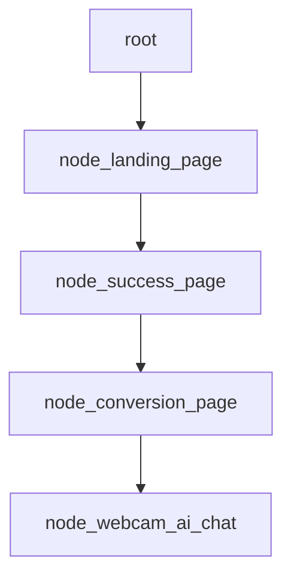
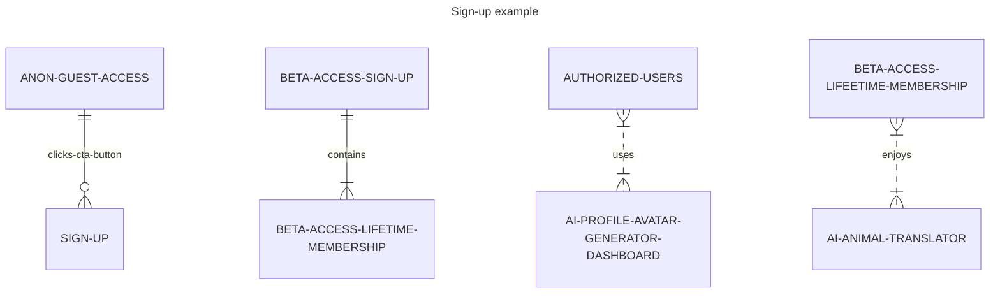

# Doggy Decoder, Digital Intelligence Animal Translator (DIAT) - Powered by [Jaseci](https://github.com/Jaseci-Labs/jaseci) and Jac - 🚧 Work In Progress 🏗

<p align="left">


</p>

The structure of the app will be in the form of a graph.

## Possible activation functions for the DNN  

- The rectified linear unit (ReLU) activation function can be used for faster model training. However, a linear activation function has two major problems :

It’s not possible to use backpropagation as the derivative of the function is a constant and has no relation to the input x.
All layers of the neural network will collapse into one if a linear activation function is used. No matter the number of layers in the neural network, the last layer will still be a linear function of the first layer. So, essentially, a linear activation function turns the neural network into just one layer.

- The DNN will be using a Tanh activation function for sentiment analysis.
- The DNN will also use Sigmoid activation function for probability distributions.

- Creating markdown mermaid diagrams as pseudocode:





## Building main.jac file

- Converting the pseudocode into Jac programming language:

```jac
# import the graph and walker.
import {*} with "./graph.jac";
import {*} with "./walker.jac";

# this walker is reponsible for starting the program.
walker init {

    root {
        /// @notice creates the landing page
        spawn here ++> node::landing_page

        #creates an instant of the graph
        spawn here ++> graph::main_graph;

        #creates an instance of the walker, talker
        spawn  --> walker::talker;
    }
}
```

## Continued in moreREADME folder
