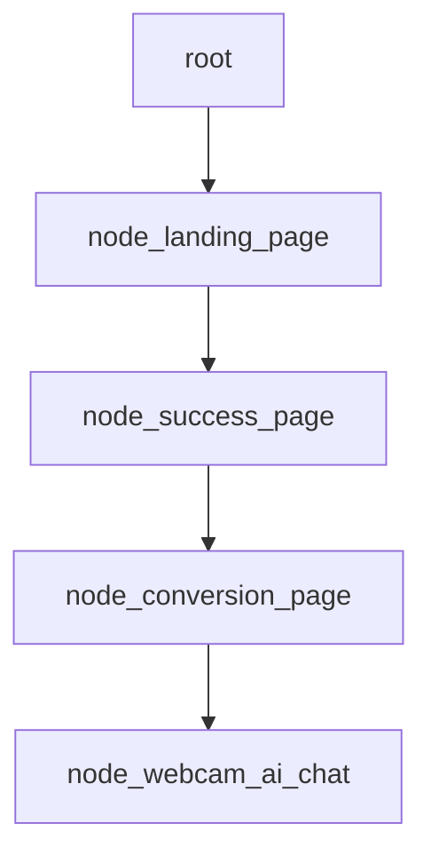
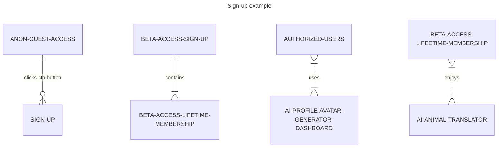

# Doggy Decoder, Digital Intelligence Animal Translator (DIAT) - Powered by [Jaseci](https://github.com/Jaseci-Labs/jaseci) and Jac - 🚧 Work In Progress 🏗

<p align="left">


</p>

The structure of the app will be in the form of a graph.

- Creating markdown mermaid diagrams as pseudocode:





## Building main.jac file

- Converting the pseudocode into Jac programming language:

```jac
# import the graph and walker.
import {*} with "./graph.jac";
import {*} with "./walker.jac";

# this walker is reponsible for starting the program.
walker init {

    root {
        /// @notice creates the landing page
        spawn here ++> node::landing_page

        #creates an instant of the graph
        spawn here ++> graph::main_graph;

        #creates an instance of the walker, talker
        spawn  --> walker::talker;
    }
}
```

## Building walker.jac file

- Converting that pseudocode into Jac programming language:

```Jac
node landing_page;
node success_page;
node conversion_page

edge anon_guest
edge authorized_user
edge user_id
edge lp_hero_section
edge lp_cta_button_clicked
edge sp_hero_section
edge sp_cta_button_clicked
edge cp_hero_section
edge cp_cta_button_clicked

walker create_app {
    
}
```

## Continued in moreREADME folder
