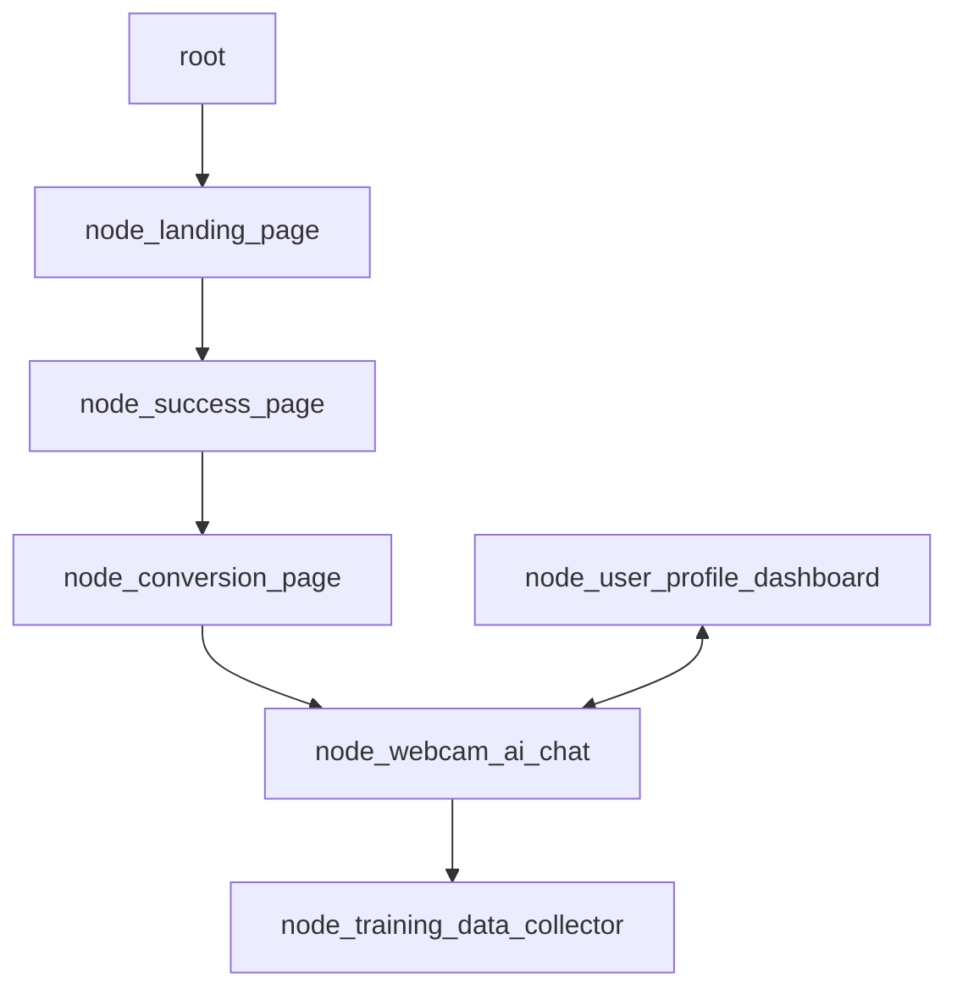
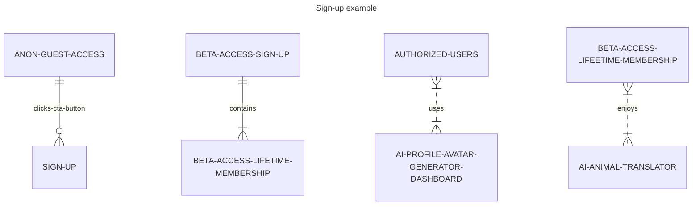

# 🐶 Doggy Decoder, Digital Intelligence Animal Translator (DIAT) - Powered by [Jaseci](https://github.com/Jaseci-Labs/jaseci) and Jac - 🚧 Work In Progress 🏗

<p align="left">


</p>

### I have no idea if this is even possible, but I think this will be a really fun project, and worth the effort to try to be the first to build an AI animal translator. I am not the only one with a project like this, so I might as well try to be the first AI animal translator! 

- DIAT, a voice-to-text, text-to-voice enabled, machine vision, image classifaction capable, customizable avatar AI, using a webcam module interface to interact with authorized users, and anon guests at sign up.
- The conversational AI Agent, will be used to interact with the human user, and provide value and helpful assistance throughout the user experience, beyond just providing animal translations.
- The machine vision and audio capable AI Agent will collect animal sounds and visual behaviour for mapping the relational training data.
- DIAT will be able to collect and train itself to translate any animal sounds (cats, dolphins, etc.) creating new training data, in order to translate all animal sounds (I just thought Doggy Decoder sounds cool, I also considered Parrot Pal).

The structure of the app will be in the form of a graph.

- Creating markdown mermaid diagrams as pseudocode:





## Building main.jac file

- Converting the pseudocode into Jac programming language:

```jac
# import the graph and walker.
import {*} with "./graph.jac";
import {*} with "./walker.jac";

# this walker is reponsible for starting the program.
walker init {

    root {
        /// @notice creates the landing page
        spawn here ++> node::landing_page

        #creates an instant of the graph
        spawn here ++> graph::main_graph;

        #creates an instance of the walker, talker
        spawn  --> walker::talker;
    }
}
```

## Cyber-Security and AI Safety Monitoring

DIAT should be programmed to avoid any communication with all other AI Agents in any other languages or forms of communication other than english. DIAT *must only communicate in english with all other AI Agents,* all other forms of communication will be programmed to be forbidden. 
- Diligent monitoring of DIAT will ensure alignment.

## Continued in moreREADME folder
