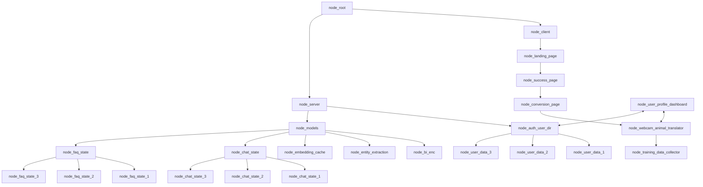
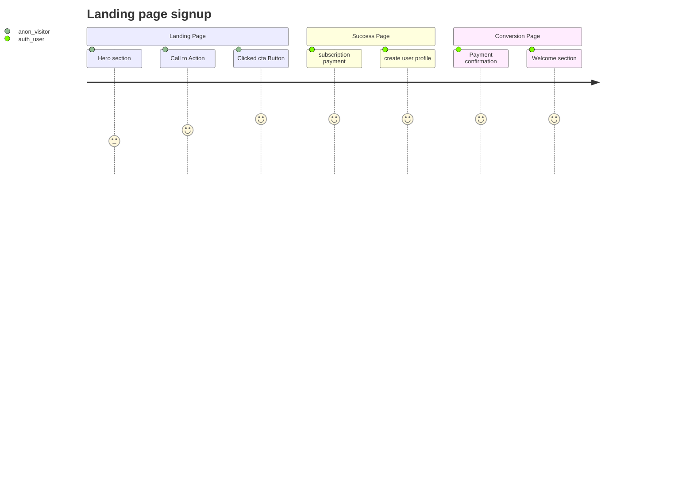
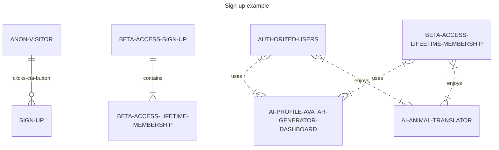

# 🐶 Doggy Decoder, Digital Intelligence Animal Translator (DIAT) - Powered by [Jaseci](https://github.com/Jaseci-Labs/jaseci) and Jac - 🚧 Work In Progress 🏗

<p align="left">


</p>

- DIAT, a voice-to-text, text-to-voice enabled, machine vision, image classifaction capable, customizable avatar AI, using a webcam module interface to interact with authorized users, and anon guests at sign up.
- The conversational AI Agent, will be used to interact with the human user, and provide value and helpful assistance throughout the user experience, beyond just providing animal translations.
- The machine vision and audio capable AI Agent will collect animal sounds and visual behaviour for mapping the relational training data.
- DIAT will be able to collect and train itself to translate any animal sounds (cats, dolphins, etc.) creating new training data, in order to translate all animal sounds (I just thought Doggy Decoder sounds cool, I also considered Parrot Pal).

## The structure of the app will be in the form of a graph

- Creating markdown mermaid diagrams as pseudocode:







```bash
sudo service redis-server restart
```

- Activating `.venv`

```bash
source .venv/bin/activate
```

- Training the bi-encoder model with the faq training data.

- Starting the Redis server

```bash
sudo service redis-server restart
```

```bash
actions load module jac_nlp.bi_enc
```

```bash
jac run bi_enc.jac -walk train -ctx '{"train_file": "chat_training_data.json"}'
```

```bash
jac run bi_enc.jac -walk infer -ctx "{\"labels\": [\"Doggy Decoder Landing Page\", \"Doggy Decoder Features and Benefits\", \"Doggy Decoder Webcam Translator\", \"Premium Beta Lifetime Membership Page\", \"Premium Beta Lifetime Membership Pricing Page\", \"Doggy Decoder Membership Page\", \"Doggy Decoder Membership Pricing Page\"]}"
```

- Save the model

```bash
jac run bi_enc.jac -walk save_model -ctx '{"model_path": "dialogue_intent_model"}'
```

- Load the model

```bash
jac run bi_enc.jac -walk load_model -ctx '{"model_path": "dialogue_intent_model"}'
```

- Running the Chatbot Example

```bash
jac run main.jac
```
